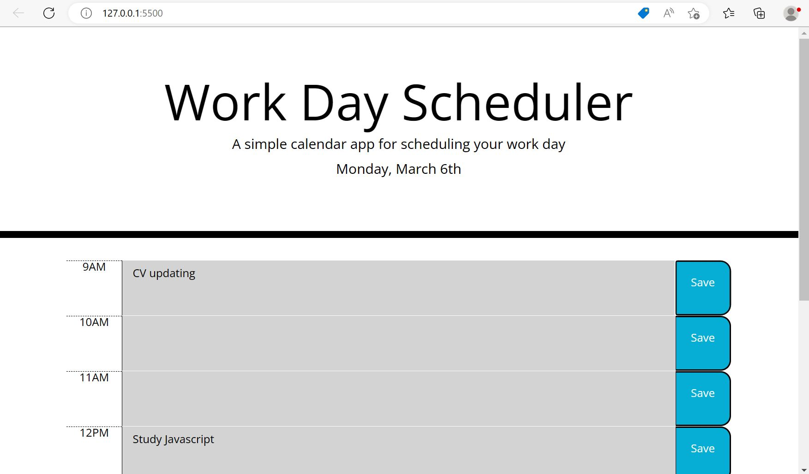
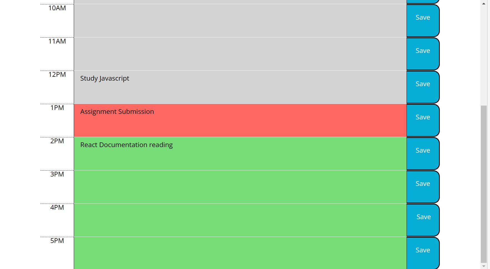

# daily_work_planner

This is a simple daily planner web application that allows users to input and save events for each hour of the day.

 https://puspitagoswami.github.io/daily_work_planner/

## Features
- Displays the current date at the top of the page.
- Highlights time blocks as past, present, or future based on the current time.
- Allows users to input and save events for each hour of the day.
- Saves events to local storage so that they persist even after the page is refreshed.
## Technologies Used
- HTML
- CSS
- JavaScript
- jQuery
- Moment.js
## Usage
To use the daily planner, simply navigate to the deployed web application at [insert URL here]. The current date will be displayed at the top of the page, and each time block will be color-coded to indicate whether it is in the past, present, or future. Click on any time block to input an event for that hour, and then click the "save" button to save the event to local storage.

## License
This project is licensed under the MIT license.

